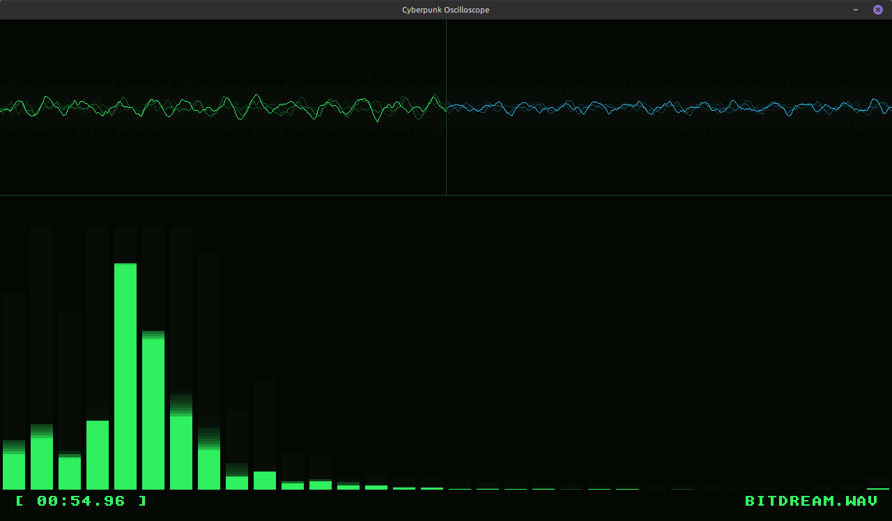

# SoundScope

A real-time oscilloscope in `C/SDL2`, for playback of `16bit PCM WAV` files. Thanks to [**k!M**](https://soundcloud.com/kim-olsen-357297567) for slowed-down audio!



Instead of just telling SDL to play a file and forgetting about it, the callback forces SDL to "ask" our program for audio data a fraction of a second before it hits the speakers. We can intercept this 16-bit PCM waveform data, copy it to a visualizer buffer, and draw it to the screen exactly as it plays.

For this demo, we will use a .wav file (since SDL2 has a built-in WAV loader). We'll also use an alpha-blended background clear to simulate the glowing phosphor fade of a classic CRT monitor.

By shifting the data left (`memmove`) and appending the new, tiny 512-sample chunks to the right, the visualizer is no longer a static flashing line. It becomes a continuously flowing stream of audio data that perfectly tracks every single high-hat and bass kick with virtually zero latency.

To convert raw audio waveforms into a frequency equalizer (EQ), we have to cross over into the realm of Digital Signal Processing (DSP) by implementing a Fast Fourier Transform (FFT).

An FFT takes a slice of time (the raw waveform) and mathematically unweaves it into its individual frequency components (Bass, Mid, Treble).

```bash
SoundScope - Real-Time Audio Visualizer

USAGE:
  ./soundscope [options] [audio_file.wav]

ARGUMENTS:
  audio_file.wav     Path to a 16-bit PCM WAV file. If omitted,
                     the program defaults to 'bitdream.wav'.

OPTIONS:
  -h, --help         Display this help menu and exit.

CONTROLS:
  [ESC]              Quit the visualizer.

EXAMPLE:
  ./soundscope my_music.wav
```
